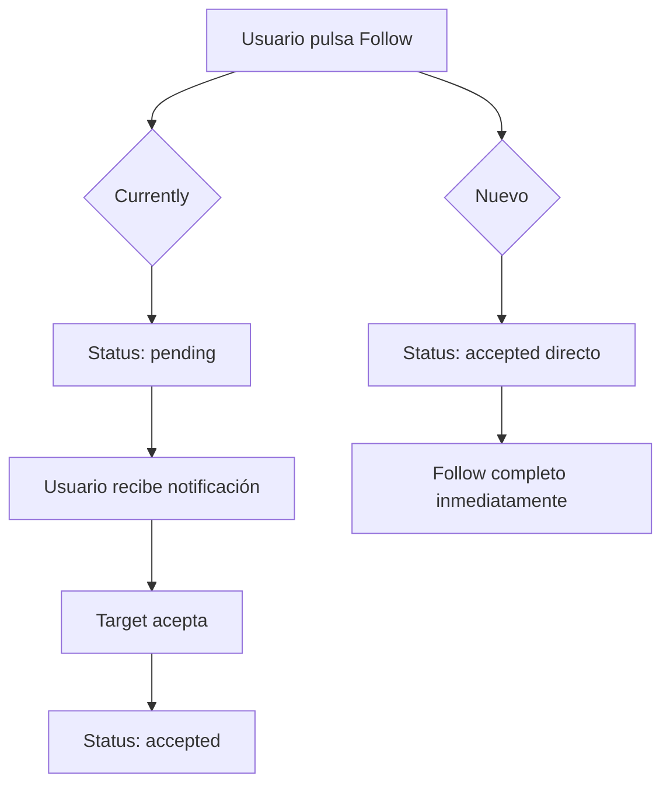
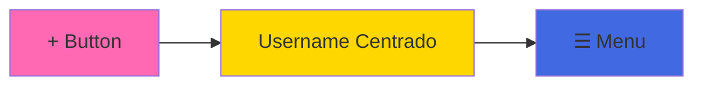

# Plan de Mejoras para KLOZET

## Resumen de Problemas Identificados

He analizado el código y he identificado los siguientes problemas que necesitas解决的:

---

## 1. Profile Page (`app/profile/page.tsx`)

### Problemas:
- **Avatar en header:** Currently muestra avatar + username, pero quieres solo username centrado
- **Botón (+):** Actualmente está a la derecha, quieres que esté a la izquierda del todo

### Cambios necesarios:
``` 
EN app/profile/page.tsx:

1. Header Section (líneas 136-163):
   - REMOVER: El div con el avatar (líneas 141-147)
   - CAMBIAR: La estructura flex para centrar el username
   - MOVER: El botón (+) de la derecha (línea 155-162) a la izquierda

2. Nueva estructura del header:
   - Izquierda: Botón (+) primero
   - Centro: Username centrado
   - Derecha: Menú hamburguesa
```

---

## 2. Edit Profile - Avatar Upload (`app/profile/edit/page.tsx`)

### Estado actual:
Ya tiene funcionalidad de upload de avatar (líneas 90-117), pero necesito verificar que:
- El input de file esté visible/usable
- La preview funcione correctamente
- El upload a Supabase storage esté configurado

### Verificar:
```
EN app/profile/edit/page.tsx:
- Línea 90-98: handleImageSelect() - Ya existe
- Línea 100-117: uploadAvatar() - Ya existe
- Línea 133-136: Uso en handleSave - Ya existe
```

---

## 3. Notifications - Avatar Loading (`app/notifications/page.tsx`)

### Problema:
Necesito verificar cómo se cargan los avatares de los usuarios en las notificaciones

### Verificar:
```
EN app/notifications/page.tsx:
- Las notificaciones deben mostrar el avatar del actor
- El tipo Notification tiene: actor.avatar (línea 31)
- Necesito ver cómo se poblán estos datos
```

---

## 4. Search Page - Recommended Posts (`app/search/page.tsx`)

### Problemas:
1. **Carga al abrir app:** Currently carga cuando entras en la página, no al abrir la app
2. **Texto "Para ti":** Quiere que se elimine

### Cambios necesarios:
```
EN app/search/page.tsx:

1. Mover data fetching a nivel de AppLayout o preload
   - Currently useEffect (línea 108) depende de que el componente renderice
   - Necesitamos: Cargar datos cuando la app se inicializa

2. Eliminar texto "Para ti":
   - Buscar donde se muestra este texto y removerlo
```

### Lógica de recomendación actual (líneas 127-143):
```typescript
// PERSONALIZATION LOGIC
if (user?.styleCompleted && user.preferredStyles?.length > 0) {
  // Intentar filtrar por preferencias
  // Currently solo hace console.log, no filtra realmente
}
```

---

## 5. Follow System - Direct Follow

### Problema Actual:
Currently el sistema usa status 'pending'/'accepted':
- `followService.followUser()` crea con status 'pending' (línea 57)
- Necesitas aceptar para ser seguidor

### Cambios necesarios:

- quiero que puedas seguir del tiron a personas o dejar de seguir a personas, si los sigues sus posts van a salir en el feed, si tienen la cuenta privada no vas a poder ver los posts de su perfil pero puedes hacer una solicitud de seguimiento, quiero que implementes esto

#### A. SQL (`sql/setup/01_initial_setup.sql`):
```sql
-- La tabla ya tiene: status TEXT DEFAULT 'accepted' (línea 225)
-- PERO el código fuerza 'pending'
```

#### B. followService.ts (`lib/services/followService.ts`):
```typescript
// Línea 54-68: followUser()
export async function followUser(
  followerId: string,
  followingId: string,
  status: FollowStatus = 'accepted',  // CAMBIAR de 'pending' a 'accepted'
): Promise<{ success: boolean; error?: string }>
```

#### C. useSocial.ts (`lib/hooks/useSocial.ts`):
```typescript
// Línea 100-115: followUser()
- Ya llama a followService.followUser()
- No necesita cambios, solo el servicio
```

#### D. Limpieza de código:
- Eliminar funciones de pending requests ya no necesarias:
  - `getPendingRequestsCount()`
  - `getPendingRequests()`
  - `acceptRequest()`
  - `removeRequest()` (para pending)

---

## 6. Message Flow - Nueva Conversación

### Problema:
Currently crear nueva conversación es complejo:
- Necesitas buscar usuario primero
- Luego navegar a sus mensajes

### Cambios propuestos:

#### A. Messages Page (`app/messages/page.tsx`):
```typescript
// Añadir botón (+) para nueva conversación
// Currently solo tiene lista de conversaciones existentes

// Solución: Añadir FAB o botón en header para nueva conversación
// Al pulsar: Mostrar lista de usuarios para iniciar chat
```

#### B. Crear conversación:
```typescript
// La función get_or_create_conversation ya existe (línea 47-48)
// Pero necesita acceso desde más lugares

// Posibilidades:
1. Desde el perfil de un usuario: botón "Message"
2. Desde Search: resultado de usuario con botón de mensaje
3. Desde Messages: botón (+) con lista de usuarios recientes/seguidos
```

---

## 7. Profile Stats - Contadores

### Verificar que funcionan:
```typescript
// EN app/profile/page.tsx líneas 76-90:

1. Posts count: outfitCount de tabla 'outfits'
2. Followers count: followService.getFollowersCount()
3. Following count: followService.getFollowingCount()
```

### Posibles problemas:
- Los contadores pueden no actualizarse en tiempo real
- Necesitan suscripciones realtime para actualizar cuando hay cambios

---

## Archivos a Modificar

| Archivo | Cambios |
|---------|---------|
| `app/profile/page.tsx` | Header: remover avatar, centrar username, mover + a izquierda |
| `app/profile/edit/page.tsx` | Verificar funcionalidad de upload de avatar |
| `app/notifications/page.tsx` | Verificar carga de avatares |
| `app/search/page.tsx` | Eliminar "Para ti", mejorar carga de posts |
| `lib/services/followService.ts` | Cambiar default status de 'pending' a 'accepted' |
| `lib/hooks/useSocial.ts` | Actualizar para seguir directo |
| `app/messages/page.tsx` | Simplificar crear nueva conversación |
| `sql/setup/01_initial_setup.sql` | Actualizar RLS si es necesario |

---

## Orden de Implementación Recomendado

1. **Profile Page** - Cambios visuales (avatar, botón +)
2. **Follow System** - Cambiar a follow directo (affecta muchas páginas)
3. **Search Page** - Mejoras de UX
4. **Messages** - Simplificar creación de conversaciones
5. **Notifications** - Verificar avatares
6. **Edit Profile** - Verificar upload de avatar

---

## Diagramas

### Flujo Actual vs Nuevo Follow



### Estructura del Header de Profile (Nuevo)


